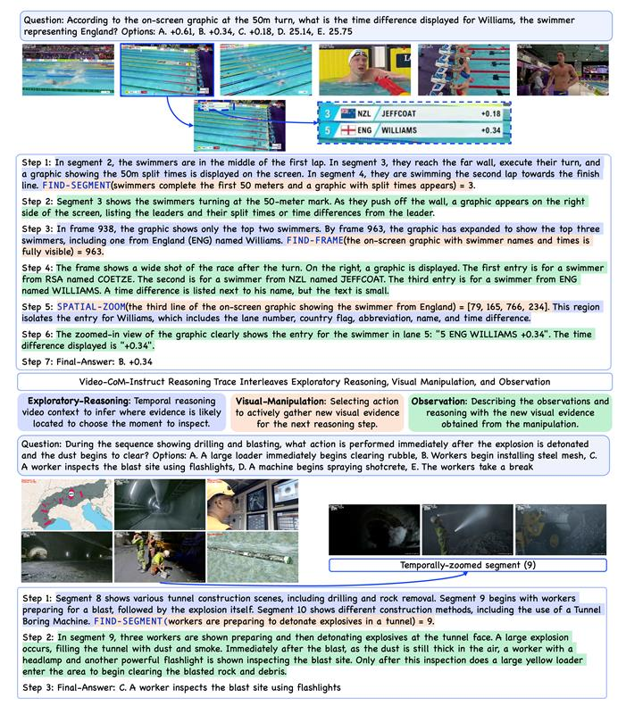
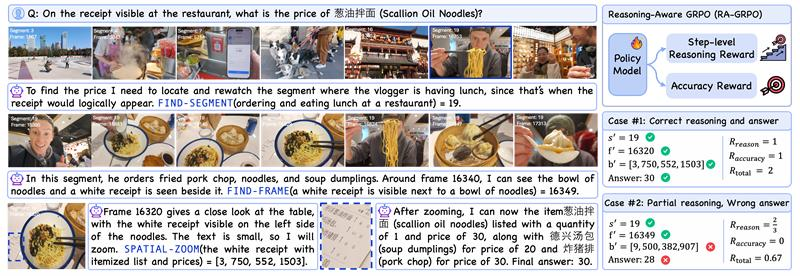
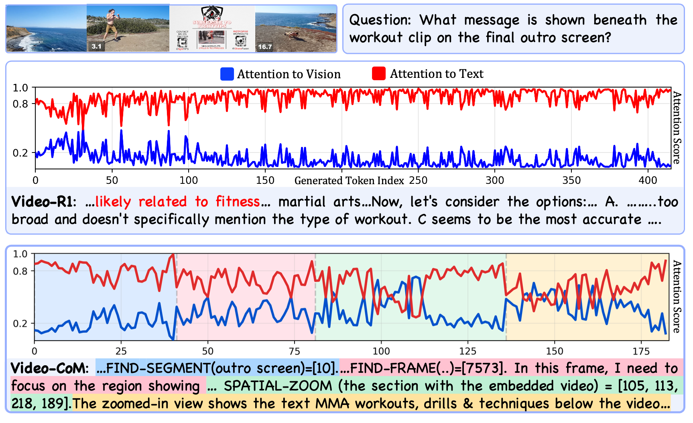

# Video-CoM: Interactive Video Reasoning via Chain of Manipulations
<!--  -->
<p align="center">
    
</p>
 
#### [Hanoona Rasheed](https://github.com/hanoonaR), [Mohammed Zumri](), [Muhammad Maaz](https://www.mmaaz60.com), [Ming-Hsuan Yang](https://scholar.google.com.pk/citations?user=p9-ohHsAAAAJ&hl=en), [Fahad Khan](https://sites.google.com/view/fahadkhans/home), [Salman Khan](https://salman-h-khan.github.io/)
 
#### **MBZUAI, University of California Merced, Google Research, Australian National University, Linköping University**
 
[](TBD)
 
---
 
## 📣 Announcement
 
Code, Dataset and Model will be released soon. Stay tuned! 🚀
 
---
 
## 💡 Video-CoM
 
**Video-CoM** introduces a new paradigm for interactive video reasoning, enabling models to **think with videos** instead of merely thinking about them. Instead of relying on a single static video encoding, Video-CoM performs iterative visual actions (segment finding, frame selection, and spatial zooming) to actively gather evidence through a **Chain of Manipulations** (CoM).
 
<p align="center">
  <br>
  <em>Video-Com reasons with videos through a coherent chain of manipulations, actively gathering and integrating visual evidence throughout reasoning.</em>
</p>
 
---
## 🔥 Highlights
 
- **Interactive Video Reasoning Framework**  
  Moves beyond passive video encoding. The model actively performs **find-segment**, **find-frame**, and **spatial-zoom** operations throughout its reasoning trajectory.
 
- **Chain of Manipulations (CoM):**  
  A structured, interpretable reasoning mechanism where each step involves retrieving new visual evidence before continuing textual reasoning.
 
- **Manipulation-Driven Dataset: Video-CoM-Instruct (18K):**  
  Carefully curated videos + dense annotations designed specifically for active visual reasoning.
 
- **Reasoning-Aware GRPO (RA-GRPO):**  
  Unlike accuracy-only RL, RA-GRPO provides **step-level reasoning rewards**, guiding consistent and visually grounded reasoning.
 
- **Srong Performance:**  
  We show strong performance across **five reasoning benchmarks** and two generic video-understanding benchmarks, along with **significant gains on our manipulation-focused benchmark**, demonstrating the effectiveness of interactive visual reasoning.
 
 
---
## 📊 Dataset: Video-Com-Instruct-18K
 
The Video-CoM-Instruct is constructed through three key stages:
1. Curating information-dense videos suited for fine-grained reasoning
2. Generating manipulation-targeted QA pairs that require segment revisiting, frame inspection, and spatial zooming
3. Dense temporal and spatial annotations to enable step-level reinforcement learning

Building on this foundation, each example follows a structured reasoning format that alternates between **exploratory reasoning**, where the model infers which moment or region likely contains the needed evidence; **visual manipulation**, where it executes targeted actions such as find-segment, find-frame, or spatial-zoom to retrieve new visual input; and **observation**, where it interprets the newly revealed evidence and integrates it into the next step.
 
<p align="center">
  
</p>
 
---

## ⚡ Reasoning-Aware GRPO (RA-GRPO)
 
Most existing video reasoning models rely solely on final-answer rewards, offering no guidance on whether intermediate reasoning steps are visually grounded or correct. To address this, we introduce **reasoning-aware rewards** enabled by our dense temporal and spatial annotations, allowing the model to receive feedback at every manipulation step. Reasoning-Aware GRPO (RA-GRPO) enhances interactive video reasoning by providing step-level rewards by evaluating the correctness of predicted manipulations.

<p align="center">
  
</p>

---

## 👁️ Attention to Visual Cues
 
Video-CoM maintains **dynamic visual attention** throughout its reasoning process, re-engaging with frames and regions whenever new evidence is needed. Unlike prior models that tend to drift toward text tokens and rely on world knowledge, Video-CoM’s attention consistently anchors to vision tokens at each manipulation step, whether locating a segment, isolating a frame, or zooming into fine details.

<p align="center">
  
</p>


## 📜 Citation
 
```bibtex
@article{rasheed2025videocom,
    title={Video-CoM: Interactive Video Reasoning via Chain of Manipulations},
    author={Rasheed, Hanoona and Zumri, Mohammed and Maaz, Muhammad and Yang, Ming-Hsuan and Khan, Fahad S. and Khan, Salman},
    journal={arXiv preprint arXiv:TODO},
    year={2025}
}
```

---

[](https://www.ival-mbzuai.com)
[](https://github.com/mbzuai-oryx)
[](https://mbzuai.ac.ae)
