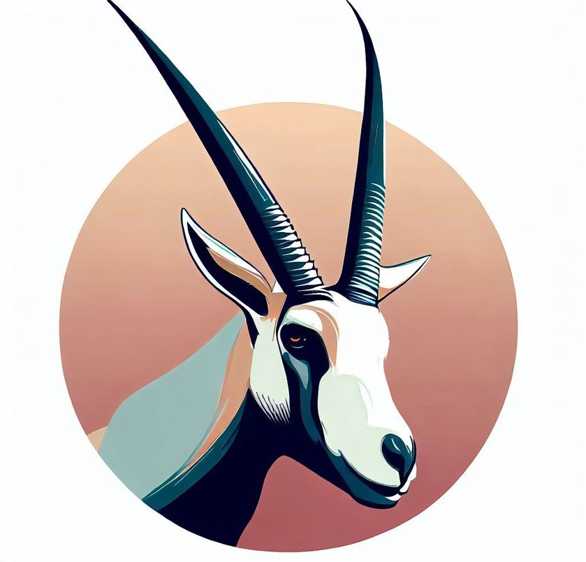

# Training

This folder contains the two-stage post-training pipeline used to build Video-R2:

1. **Stage 1: SFT** starting from **Qwen2.5-VL-Instruct**
2. **Stage 2: RA-GRPO** guided by Step-level reward.

The main entrypoints are:

- `src/train/train_sft.py`
- `src/train/train_grpo.py`

Sample multi-GPU launch scripts are provided in `scripts/`:

- `scripts/train_sft.sh`
- `scripts/train_grpo.sh`

## 1) Environment

```bash
conda create -n video-com python=3.12 -y
conda activate video-com
pip install -U pip

# We use torch v2.7.0, torchvision v0.22.0 and transformers v2.51.1 in the development of Video-R2
# Please see requirements.txt for more details.
pip install -r requirements.txt

# Further, we recommend installing flash-attn v2.7.4.post1 or v2.8.3 for training
```

## 2) Download and Arrange the Dataset

We release the datasets used in Video-CoM development on Hugging Face:

- https://huggingface.co/datasets/MBZUAI/Video-CoM-Dataset

Download:

```bash
hf download MBZUAI/Video-CoM-Dataset --repo-type dataset
```

Extract the `.tar` media files.


## 3) Stage 1: SFT (from Qwen2.5-VL-Instruct)

We start from the instruction-tuned Qwen2.5-VL model:

- `Qwen/Qwen2.5-VL-7B-Instruct`

1) Edit and run the script `scripts/train_sft.sh`:

```bash
cd train
bash scripts/train_sft.sh
```

## 4) Merge LoRA weights (optional)

Merge the LoRA checkpoints after SFT:

```bash
python src/merge_lora_weights.py \
  --base_model <base_model_id_or_path> \
  --lora_model <lora_checkpoint_path> \
  --output_dir <merged_output_dir>
```

## 5) Stage 2: RA-GRPO

We perform RA-GRPO starting from the SFT checkpoint.

1) Edit and run the script `scripts/train_grpo.sh`:

```bash
cd train
bash scripts/train_grpo.sh
```


## 📜 Citation
 
```bibtex
@article{rasheed2025videocom,
    title={Video-CoM: Interactive Video Reasoning via Chain of Manipulations},
    author={Rasheed, Hanoona and Zumri, Mohammed and Maaz, Muhammad and Yang, Ming-Hsuan and Khan, Fahad S. and Khan, Salman},
    journal={arXiv preprint arXiv:2511.23477},
    year={2025}
}
```

---

[](https://www.ival-mbzuai.com)
[](https://github.com/mbzuai-oryx)
[](https://mbzuai.ac.ae)